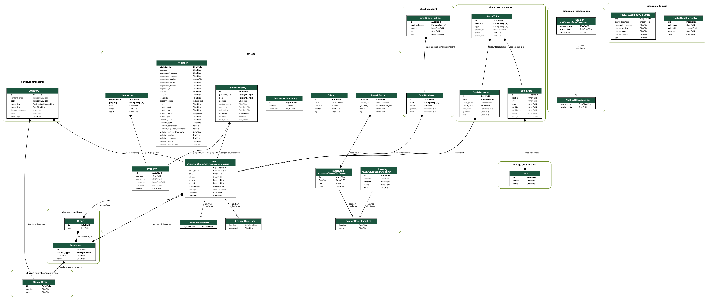

Our app depends on key data sources:

- [**Inspections**](https://data.cityofchicago.org/Buildings/Building-Violations/22u3-xenr/about_data): The City of Chicago releases data on building inspections, including how they have been handled by landlords. It is updated daily. We currently use a slice of this data for Hyde Park apartments from April 2025. This data will be analyzed to show inspection violations for potential apartments.
- [**Transit routes**](https://www.transitchicago.com/developers/gtfs/)** (currently only Chicago Transit Authority Bus Routes): The Chicago Transit Authority releases GTFS bus route information. We currently use these bus stops to display the closest stop to users. As of May 2, 2025, we do not include route information within the postGIS database, but have established schema to do so.
- **Groceries**: We manually collect grocery stores around Hyde Park including their location. We bound this by geographic area. This data will be visually.
- **Input address**: We expect users to input an unstructured string which will be parsed and geocoded by open source packages (`usaddress` or `postal`). The parsed string will be delivered back to the user and placed on the map

Since most of these data are being directly displayed on the map screen itself, they are reflected in our data model:

